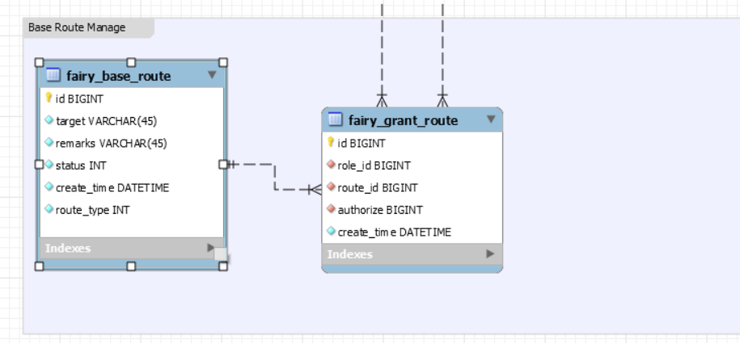

# fairy-pro

##### 采用的技术集成

1. 项目管理 https://zube.io/a854363956/fairy-pro/w/development/kanban  
2. 持续集成 https://circleci.com/dashboard 
3. projectlombok 
4. spring-boot 
5. spring-data-jpa
6. gradle 版本 5+
7. java 1.8 
8. mysql 8


> 所有对字符串的格式统一为UTF-8 ,如果是在代码中编写的统一使用Charsets.UTF_8  

##### 项目结构描述 

```bash
.
+-- src/main/java                   # 项目代码
|   +-- com.fairy
|       +-- config                  # SpringBoot的相关配置的Java Bean
|           +-- interfaces          # 通常用来处理配置文件里面需要的接口
|       +-- controllers             # 用来处理当前控制器
|       +-- models                  # 用来处理所有的模块信息
|           +-- common              # 用来处理所有的通用的文件
|           +-- dto                 # 所有数据传输实体的对象
|           |   +-- jpa             # 数据库和Java Bean转换的对象
|           +-- logic               # 所有业务的代码
|               +-- jpa             # 所有操作数据库的方法
+-- src/main/resources              # 项目配置文件
+-- src/test/java                   # 单元测试文件
+-- sqlscript                       # 关于数据库的表结构设计文件,以及数据库dump
+-- LICENSE                         # 许可说明 
+-- README.md                       # 项目说明文件
```

>  如果想拿到用户当前登入的消息,则使用```@Autowired private Session session;``` 通过com.fairy.models.common.Session 可以有一些通用的方法来进行获取用户当前会话中的数据    


#### 项目分支描述

项目包含两个分支  

1. master 分支
2. dev    分支  

> master 为主要版本分支 ,dev为开发版本,暂时未发布稳定版本 
##### 统一返回对象

com.fairy.models.dto.ResponseDto  

|字段名称  | 字段类型    | 备注 
|-----   |-----     |----
|status  |int       | 状态码
|message |string    | 返回的消息信息
|data    |any       | 返回的数据对象

状态码:  

|状态码     | 说明 
|-----   |----
|200     |数据请求成功
|500     |服务处理消息报错,错误信息为message中返回的信息
|510     |表示此请求在被拦截器验证的失败了

##### 统一的请求对象

com.fairy.models.dto.RequestDto

|字段名称  | 字段类型    | 备注 
|-----   |-----     |----
|token   |string    | 当前登入的令牌
|data    |any       | 返回的数据对象

> 通过token来校验当前数据是否是登入状态,在调用/api/user/login接口,如果登入成功则返回一个64位的token

##### 用户管理 

1. /api/user/login  用户登入接口
2. /api/user/logout 用户登出接口 
3. /api/user/addUser 添加用户 
4. /api/user/delUser 删除用户

##### 关于URL请求权限控制 

1. fairy_base_route 维护路由的基础信息
2. fairy_grant_route 维护路由信息授权表 



> fairy_base_route.route_type 表示当前路由中,这个路由所属的权限,0 表示超级管理员 1表示系统管理员 0表示普通用户,对于敏感数据而言的接口应当只运行超级管理员来进行访问 


##### 警告!!! 

1. Nginx反向代理后,会导致fairy_base_session表中的ip_addr字段为Nginx的IP地址,而不是真实的IP地址  - 以后调整


