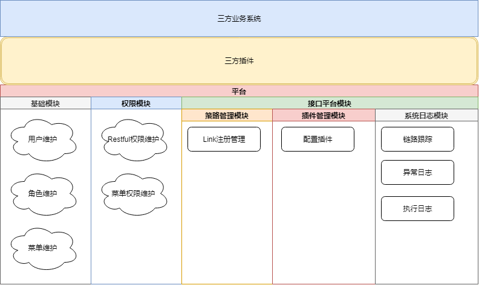
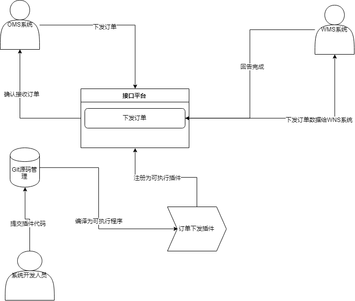

## 关于fairy-pro项目介绍 

  

三方系统-> 平台-> 插件 -> 三方系统

其实可以这样理解,先开发一个容纳小程序的,大的应用平台,然后基于这个大的应用平台来根据它的规则来开发对应的系统模块

> 相当于平台只是来管理插件的部署,开发已经对应的统一的模块管理,比如对应的日志管理,link追踪

### 关于执行流程 

一个系统的组成是由很多个模块来进行组成的,我们大部分精力花在各种各样的框架,日志,权限等等基础功能模块,导致重复的cpoy,或者拉分支的方式进行管理

例如一个TMS系统: 

|模块名称       |A公司        | B公司    | 描述
|----       |---      |---    |----- 
|权限管理       | 需要         |需要        |-
|订单管理       |需要          |不需要    |-
|运输计划       |需要          |需要        |业务需求不一样,差异化开发
|运输执行       |需要          |需要        |-
|运输实绩       |需要          |需要         |-
|库存管理       |需要          |需要         |-
|结算管理       |需要          |需要         |-
|分析管理       |需要          |需要          |-

对于这样一个系统的组成,我们往往需要cpoy或者拉一个独立的分支来进行管理,无论是部署,还是维护,开发花的精力往往随着项目的发展而越来越大

我们采取这样的方式,首先建立一个空的平台,然后基于平台构建运行的插件模块这样的好处有很多  

1. 在更新系统模块的时候无需停运系统
2. 模块更加解耦了,一个功能模块崩溃,不会影响到整个系统的崩溃
3. 开发更加方便无需了解整个框架的技术架构,只需要了解插件开发手册即可
